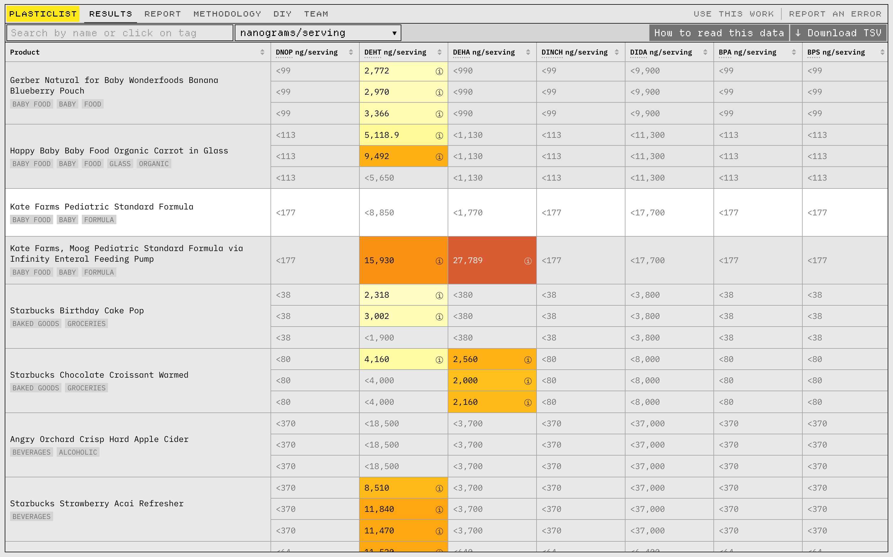
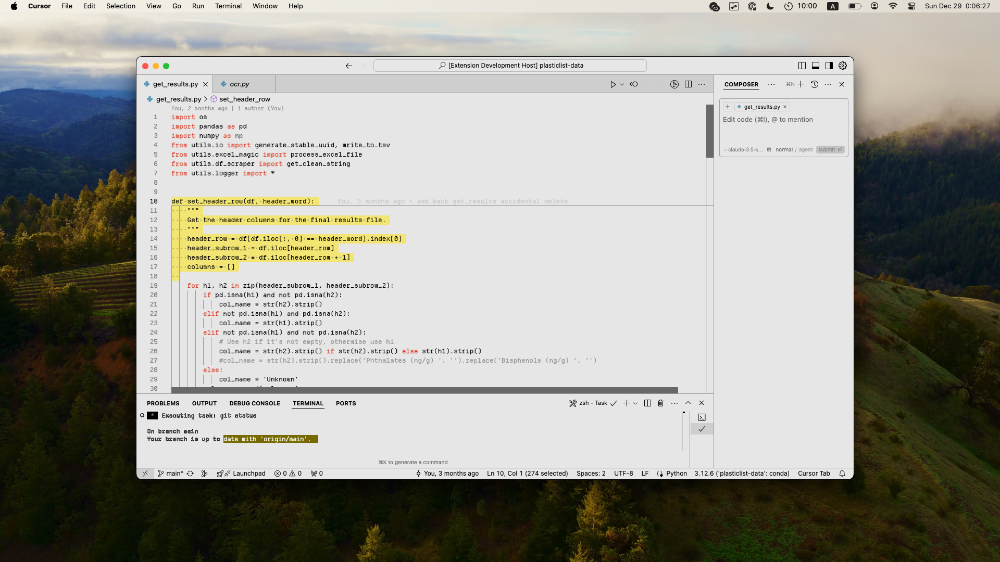

# PlasticList Theme




Ever wanted to feel like a jet pilot controlling an cool-looking, information-dense dashboard while you code? Well, now you can.

Experience the aesthetic functionalism of plasticlist.org in your code editor. 

## Installation

1. Open the Extensions view by clicking on the Extensions icon in the Activity Bar on the side of the window or by pressing `Ctrl+Shift+X`.
2. Search for "PlasticList Theme" in the search bar.
3. Click on the "Install" button to install the theme.
4. Once installed, you can activate the theme by clicking on the "Activate" button in the Extensions view or by selecting it from the list of themes in the Settings view.

## Usage

Once activated, the theme will apply to your entire VS Code environment. You can customize the theme further by adjusting the settings in the Settings view.

For the most authentic plasticlist.org experience, download and install the [Departure Mono font](https://departuremono.com/). Then, set it as your editor font by adding this to your settings.json:

```json
{
  "editor.fontFamily": "Departure Mono"
}
```

